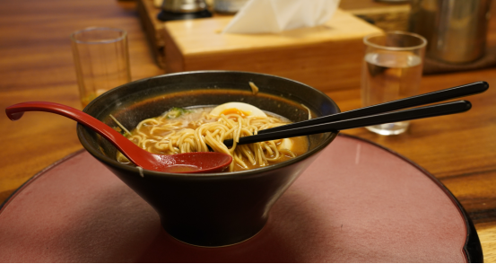
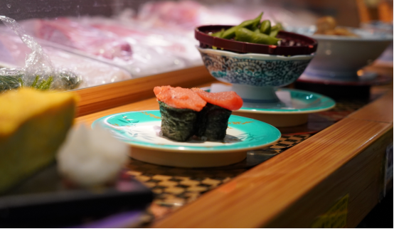
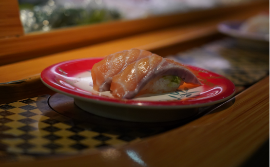
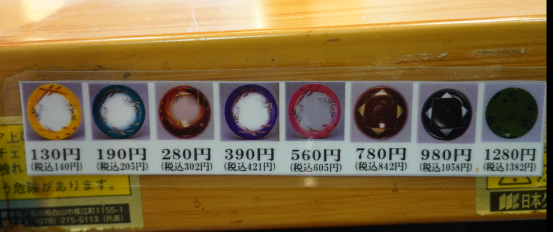
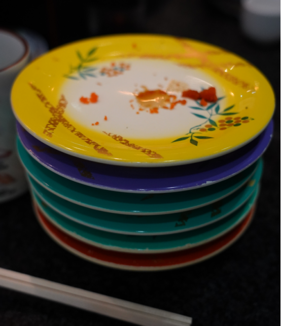
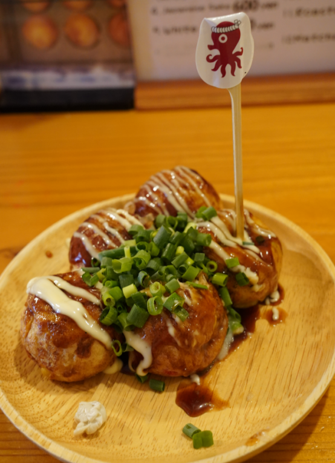
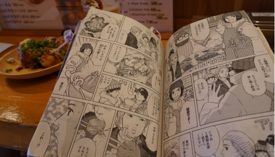
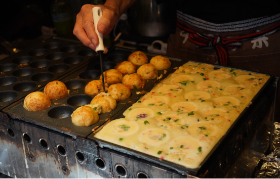
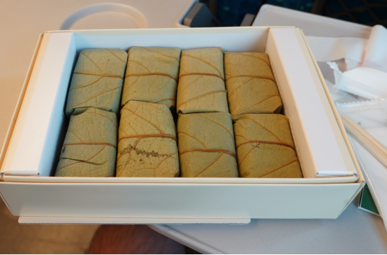
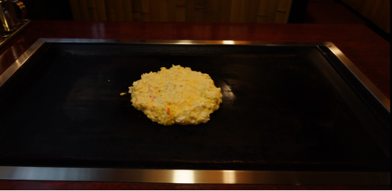

Ohhh… man - endless options as you can imagine!

Last time when I went with my father for 2 weeks, we ate everyday a different japanese dish, no repeat :)

# Ramen

No need to introduce ;)

# Conveyor Belt Sushi

You pay by plate, different colors of plates - different prices: Amazing! :)

# Takoyaki

# Bento Boxes

# Okonomyiaki

