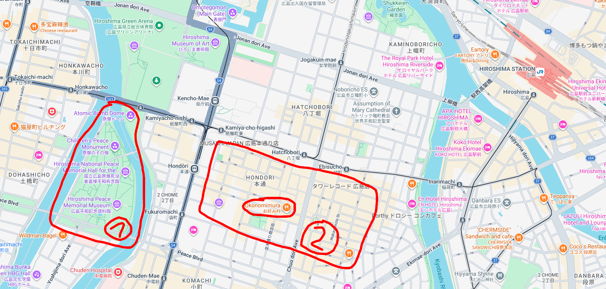
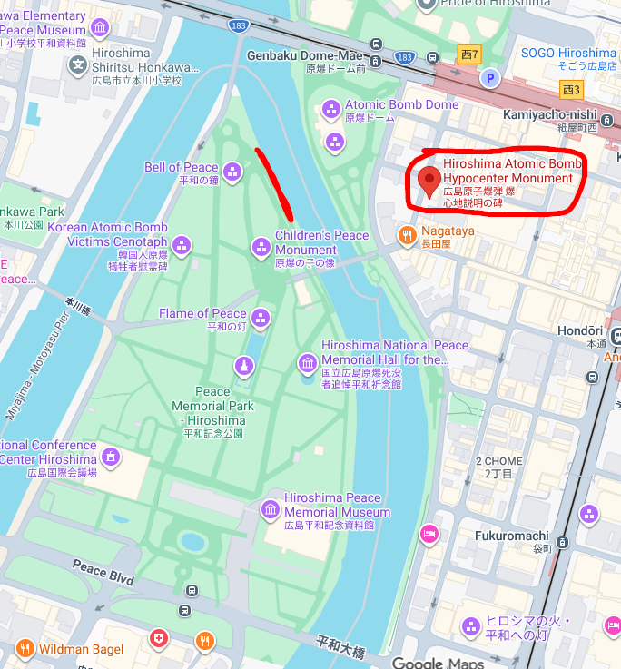

# Background

- I arrived to Hiroshima around midday.
- I came from Miyajima.
- In the next day in the late moring I had my train back to Tokyo.

So in total I didn't spend a lot of time there, but the most important for me was to see `Peace Memorial Park`

# Peace Memorial Park

On the main map - indicated with number 1

The highlight of Hiroshima to see. Easily walkable, not that huge, I guess I was done with everthing in around 2 hours,
I didn't go to any exhibition in the buildings there though, only saw what was outside. It's really worth to see all the places in the park that you can see on google maps.

On the map with `Peace Memorial Park` I indicated a red line, directly on the other bank of the rived to `Atomic Bomb Dome`. There is an interesting commemorative plaque with a picture how the Dome looked before the A-Bomb.

Also, nearby the park, in a small street, there is another commemorative plaque, this one is about `Atomic Bomb Hypocenter`. Really worth go there to see the history.

# Okonomimura

On the main map - indicated withing the area with number 2

Hiroshima is famous for its `okonomiyaki`. `Okonomimura` is a food hall where mutliple vendors prepare various types of okonomiyaki.
Good spot for grab food.

Also the whole area indicated number 2 is the area with many restaurants and nightlife, especially on the right hand side from the main road there.
